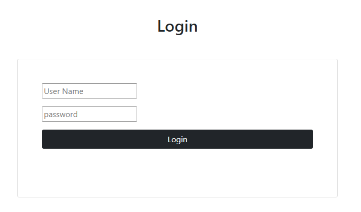
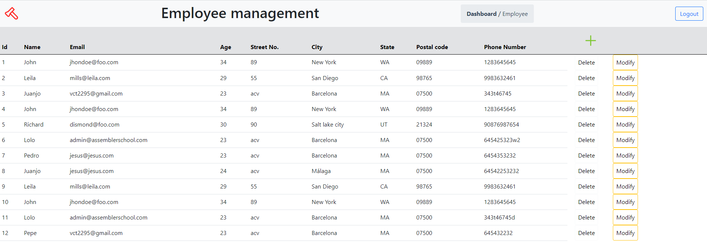
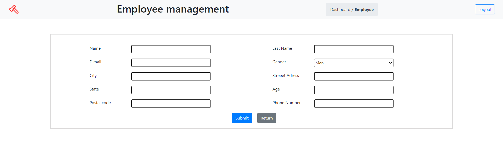

`#php` `#mvc` `#master-in-software-engineering`

# Employee Management V2 <!-- omit in toc -->

<p>
  
</p>

> This project provides an easy-to-use interface to manage employees information. The application user case starts with an user log in, and allows the user to read, create, delete and update the employee´s information. The user and employee data is stored in a database.

> This project objective is to create a file structure following the MVC pattern, with a basic router implementation and OOP approach.

## Index <!-- omit in toc -->

- [Requirements](#requirements)
- [Install - Run](#install---run)
- [Technologies used](#technologies-used)
- [Download project](#download-project)
- [Usage](#usage)
- [Based on](#based-on)


## Technologies used

\* Visual Studio Code - Developement IDE

\* HTML - Markup Language

\* CSS - Style Sheet Language

\* Javascript - Programming Language

\* Bootstrap - Front-end Library

\* OOP - Object Oriented Programming

\* MVC - Model–view–controller 

\* PHP - Scripting language

\* XAMPP - Open source cross-platform web server


## Usage

```sh
This project could be used to manage employee information.
```


## Images

### Login page


### Dashboard page


### Employee page


### Error page


## Based on

This repository is based on a past delivery from master's students Alejandro Gaerste and Joan Gau. The project has been enhanced by the addition of OOP, MVC, and a few functions, such as the ability to update an existing employee, display an error page, and display a message when adding or deleting an employee.


## Login
**User:**  admin@assemblerschool.com
**Password:**  123456

## Work done by:

👤 **Juan Carlos Cabello** (https://github.com/JcarlosCabello1991)

👤 **Víctor García-Vao** (https://github.com/victor-gv)


